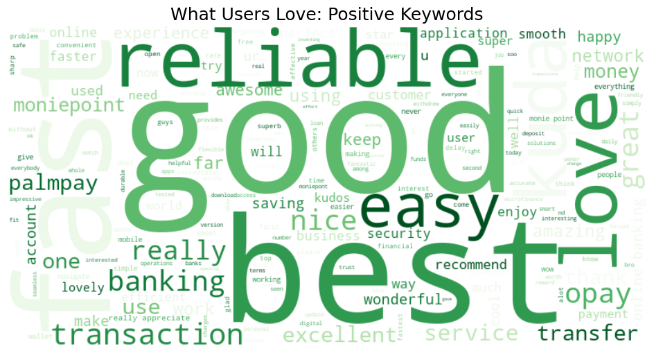
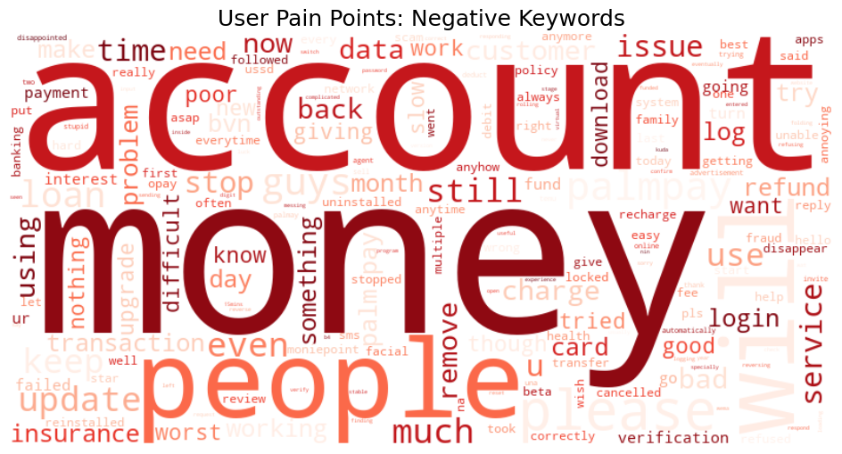

# 🇳🇬 Nigerian Fintech Sentiment Annotation

## 📌 Project Overview
This project features the manual sentiment annotation of 572 user reviews from top-tier Nigerian fintech platforms: Opay, Moniepoint, Palmpay, and Kuda. 
The goal was to transform raw, unstructured Play Store feedback into a "Golden Dataset" optimized for sentiment analysis and NLP model training. This project demonstrates a full end-to-end data pipeline, from Docker-based tool deployment to final data validation.

**Dataset Size:** 572 
 **Language:** English (including Nigerian Pidgin nuances)  

---

## 🎯 Objective
- Classify each user review into **one of three sentiment categories**:
  1. **Positive** ✅ – User expresses satisfaction, praise, or favorable experience.
  2. **Neutral** ⚪ – User expresses a neutral or factual statement without strong sentiment.
  3. **Negative** ❌ – User expresses dissatisfaction, criticism, or negative experience.

---

## 🛠 Annotation Tool
- **Label Studio** (via Docker)  
- Each record was manually reviewed and labeled based on the **actual review content** (ignoring the rating score).

---

## ✍ Annotation Guidelines
- Read the full review before labeling.  
- Assign **one sentiment per review**: Positive, Neutral, or Negative.  
- Ignore numerical ratings; focus on **review content**.  
- Remove emojis and extra whitespace in text for consistency.  
- If a review is ambiguous, assign **Neutral**.  
- Ensure **no duplicates** and all records are labeled.  

For full details, see: [`annotation/annotation_guidelines.md`](annotation/annotation_guidelines.md)

---

## 📊 Sentiment Distribution
Based on the final 572 labeled reviews:

| Sentiment | Percentage |
|-----------|------------|
| Positive  | 80.24%     |
| Negative  | 14.51%     |
| Neutral   | 5.24%      |

**Wordclouds for Positive and Negative Sentiments**:  




---

## 🗂 Project Structure

<pre>
```nigerian-fintech-sentiment-annotation/
├── annotation/
│   ├── annotation_guidelines.md
│   └── label_studio_config.xml
├── data/
│   ├── annotated/
│   │   ├── final_labeled_fintech_data.csv
│   │   ├── sentiment-reviews-label-2026-03-09-09-51.json
│   │   └── sentiment-reviews-label-2026-03-09-09-51.csv
│   ├── cleaned/
│   │   ├── fintech_reviews_cleaned.csv
│   │   └── fintech_reviews_cleaned_human.csv
│   └── raw/
│       └── fintech_reviews_raw_032026.csv
├── notebooks/
│   ├── 01_data_cleaning.ipynb
│   ├── 02_exploratory_analysis.ipynb
│   ├── 03_quality_checks.ipynb
│   └── wordclouds/
│       ├── negative-wordcloud.png
│       └── positive-wordcloud.png
├── scripts/
│   └── cleaned_reviews.py
├── requirements.txt
├── README.md
└── .gitignore```</pre>

``
## ⚙️ Tools & Libraries

- Python: pandas, numpy, matplotlib, seaborn, wordcloud, re
- Jupyter Notebook for EDA and quality checks
- Label Studio (via Docker) for annotation
- Virtual environment for dependency management
```

```
## 📈 Workflow

- Data Cleaning: Remove nulls, duplicates, emojis (cleaned_reviews.py / 01_data_cleaning.ipynb)
- Exploratory Analysis: Visualize distributions, generate wordclouds (02_exploratory_analysis.ipynb)
- Quality Checks: Ensure consistency and correctness of labeled data (03_quality_checks.ipynb)
- Sentiment Annotation: Manual labeling in Label Studio with exports stored in data/annotated
```